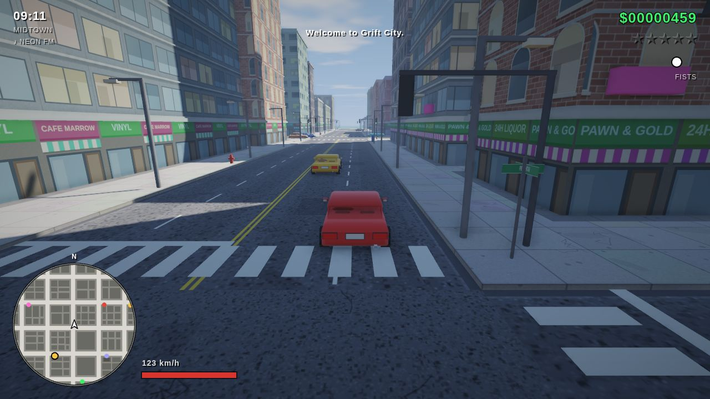
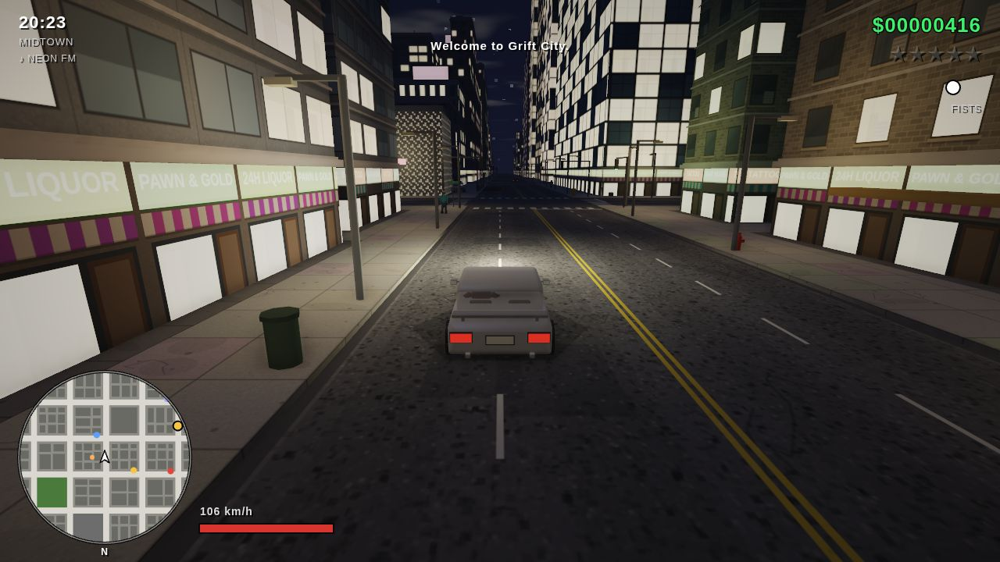
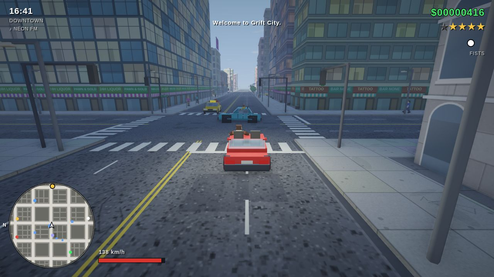

# GRIFT CITY

*a 3D open-world crime game in the browser* — one folder of plain JavaScript
and WebGL2, no build step or runtime dependencies; art assets are embedded.

Open `grift-city/index.html` in a desktop browser and click. There is also a
single-file build in `dist/grift-city.html` if you would rather host or hand
around one file; `python3 tools/build-single.py` regenerates it.

> Ten by ten blocks of an island city. Traffic that stops at the lights.
> Pedestrians who scream. Police who never forget. A garage in Midtown with a
> woman inside who has work for you.





## What it is

A third-person open-world game in the shape of the early 3D crime games: you
walk, you steal a car, you drive too fast, you shoot, the stars climb, the
helicopter comes. Nine story missions for Marla Voss run from a repo job to a
bank heist to a shoot-out in a Downtown plaza; nine more for Captain Okafor at
Pier 9 open up once Marla trusts you, among them a stealth job, a
photography job, a tanker that takes a car yard with it and a boat chase; four contracts
come in on payphones. Missions branch on what you do (a debtor who dies
before he can be repossessed, a collector who keeps his fingers), keep
checkpoints at their hard turns, and give a third attempt more time and a
vest.
Between them the city stays open: taxi fares, vigilante chases, three
rampages, twenty hidden packages, six unique stunt jumps, gun shops, a Pay
'n' Spray, and a safehouse with a bed that saves the game and a kerb that
keeps whatever you parked there.

The city layout and most geometry are generated at runtime. Building facades,
roads, sidewalks and billboards combine canvas-painted details with embedded
photographic materials; selected vehicles, vegetation and props use embedded
Kenney models. Every sound, including the radio stations, is synthesised.
The game needs no asset downloads to run. See **Imported art** below for sources
and regeneration tools.

## Playing

|                       |                                            |
| --------------------- | ------------------------------------------ |
| Move / drive          | `WASD` or arrows                           |
| Look / aim            | mouse (click the game to capture it)       |
| Attack / fire         | left mouse button                          |
| Aim                   | right mouse button, two-finger click, or hold Option/Alt or `C` |
| Sprint                | `Shift`                                    |
| Jump / handbrake      | `Space`                                    |
| Enter or leave a car  | `F`                                        |
| Weapons               | scroll wheel, `Q` / `E`, or `1`–`8`        |
| Radio / horn / siren  | `R` / `H` / `L`                            |
| Taxi or vigilante job | `T` in a taxi or a police car              |
| Map / pause / mute    | `Tab` / `Esc` / `M`                        |
| Retry a failed job    | `Y` (within half a minute of failing)      |
| Photo mode            | `P` (WASD/QE fly, wheel zooms, click saves) |
| All controls          | `F1` (a sheet in the game; the bottom line always shows the keys for what you are doing) |
| Shop menus            | `1`–`9` to pick, `Esc` to leave            |

Gamepads work: left stick moves, right stick looks, triggers fire and aim
(on foot) or drive (in a car), A sprints or handbrakes, B jumps, X enters
cars, bumpers change weapon.

Yellow markers are jobs. Walk into the one outside VOSS MOTORS to meet
Marla; the blue one at PIER 9 is Okafor, once you have done enough for
Marla. Blue markers at street-corner payphones ring with contracts. Orange
skulls start rampages. Red markers are IRONMONGER gun shops, the yellow
driveway marker is a Pay 'n' Spray (drive in with a wanted level and $100),
and the pink marker outside the safehouse saves the game and sleeps six
hours. Park a car beside it before you save and it will be there when you
come back.

`Esc` opens the pause menu, which is also the options menu: mouse
sensitivity, inverted look, shadows, bloom, render scale and auto quality.
The menu shows the frame rate. Auto quality (`A`, on by default) watches
it and, when frames stay slow, steps the renderer down one notch at a
time (render scale, then ambient occlusion, then a lower scale, then
shadows, then the post pass) and steps back up when there is headroom;
the menu says how far it has stepped. The game itself keeps real-time
pace regardless: a slow frame is simulated as several sixtieth-of-a-second
steps rather than one long one, so on a slow machine you still walk, run
and drive at full speed, only with fewer pictures of it.

Old habits: type `BIGBANK`, `KEVLAR`, `ARSENAL`, `COOLOFF`, `HOTHEAD`,
`NIGHTFALL`, `SUNRISE`, `DOWNPOUR`, `CLEARSKY`, `FALCATA` or `BASTION` during play.

## The city

Six districts on one island, joined by four-lane roads with working traffic
lights and crosswalks:

- **Downtown** — glass towers, the bank, and CRANE HOLDINGS.
- **Midtown** — offices, Voss Motors, the 3rd Precinct.
- **Northgate** — brick and tenements; the safehouse is here.
- **Westfield** — low and leafy, with parks and a clinic.
- **Eastside** — warehouses and the gang that keeps them; the 9th Precinct.
- **Southport** — the beach, Pier 9 and the docks.

A day lasts twenty-four real minutes; at night the windows come on and
the police helicopter's searchlight is the brightest thing in the sky. Rain
comes and goes on its own schedule and takes the shadows with it.

Three parking lots at the corners of the island carry stunt ramps. Twenty
hidden packages are tucked into corners; every five unlocks a weapon at the
safehouse.

## The jobs

Missions record their failures: fail one and `Y` puts you back at the
mission giver, or at the last checkpoint if the mission set one (the ambush
in SPECIAL DELIVERY, the last lap of MIDNIGHT RUN); the third attempt runs
its clocks at 1.4x and starts you with a vest. Some intros are written at
the moment they start, so Marla knows whether you already own a car.
Okafor's later jobs are less about shooting: QUIET WORK puts four patrolling
guards around a hut and fills a detection bar when you stand in their sight
or run near them (gunfire within earshot rings the alarm outright), EVIDENCE
hands you a camera that scores a frame by distance, aim and line of sight,
and FIREWORKS is one tanker parked next to six cars.

## Getting around

Eleven kinds of car, a motorcycle and a speedboat. The VIPER motorcycle
takes the same tyre model as the cars with a rider who leans into the
corners; a hard stop puts them over the bars, so treat kerbs with respect.
Three SKIMMER boats are moored beside Pier 9 and off the beach. On the water
the rudder needs way on, the hull slides wide through a turn, and the shore
and the pier are walls. You cannot swim: `F` only gets you out of a boat
within a few metres of land, and a boat that sinks under you takes you down
with it. Okafor's last job, SALT WATER, is a boat chase round the island.

## Indoors and off duty

Two doors open. THE HALFWAY, a bar in Northgate, sells whiskey that heals
a little and makes the camera and the steering wander for a while, tips
about where a hidden package is hiding, a round for the room that Marla
hears about, and a jukebox. The safehouse has a bed that saves the game
and a wardrobe with five outfits. Rooms are real geometry sixty metres
under their own lot, with walls the player and the camera collide with
and lamps instead of a sun.

Presentation: each district has its own colour grade that the picture
drifts toward as you cross a boundary; dialogue cuts between shots on
every line, and whoever is speaking moves their mouth; a cruiser's siren
rises as it closes and falls as it pulls away. `P` opens a photo mode
that freezes the world and hands you a free camera; click or `Enter`
saves a PNG.

## Fists, falls and the roof

Every third punch is a kick that does more and puts people down; a bat
from the Ironmonger (or from under the bar) reaches further. Peds flinch
when they are hit. Weapons are drawn in the hand: a pistol, a machine
pistol, a shotgun, a rifle, a launcher, a grenade, the bat and the camera
each have their own model riding the right forearm. Walk off a roof and
you fall; from anything taller than a house it hurts, from Crane Holdings
it kills. A service elevator on the tower's front takes you to its roof,
where a helipad keeps a briefcase, a vest and a launcher. A stunt jump
holds the camera on the ramp and watches the car fly. The Ironmonger
closes from eleven at night to seven. Reach five stars and Crane puts a
price on your head: three crews come for you, one at a time, whenever the
police have lost interest, and each one drops what he paid them.

## What you see on the street

Ground floors are painted from sixteen kinds of shop, two to a tile, each
with its own sign, window and door: bodegas with crates of fruit, diners
with neon and stools, pharmacies with a green cross, laundromats,
bars, pawnbrokers behind bars, bookshops, cafes with chalk menus, barbers,
tattoo parlours, all-night liquor stores, noodle houses with red lanterns,
electronics with a wall of screens, boutiques with mannequins, florists
and bakeries; some fronts are shuttered and flyposted. Every eight
metres of wall takes a different tile drawn from the district's mix, so
a block reads as a row of separate businesses. Upper floors come in
sixteen facade styles with balconies, window boxes, air conditioners,
fire escapes and faded painted adverts on side walls; offices downtown
fly banners, tenements have stoops, Westfield houses have fences and
front gardens. The sidewalks carry cafe tables, crates, sandwich boards,
vending machines, barber poles, bike racks, flower buckets, tyre stacks,
barrels and hot-dog carts with a vendor behind them.

People have a skull and a jaw, eyes with irises and brows, a nose, ears,
eight hair styles from a bun to an afro, beards, open jackets with
lapels over a shirt, cuffs, thumbs and shaped shoes, in fabric colours
rather than paint. Shop names are drawn from a hundred without
repetition across twenty tiles, so no two doors down a street read the
same.

The city is populated by district: suits downtown, hi-vis on the east
side, joggers in Westfield, wool by the water. People carry coffee, bags,
phones and guitars, put umbrellas up in the rain, wait at bus shelters,
stop to look in shop windows and sit on benches. Pigeons feed on the
sidewalks and scatter when you or a car come close, gulls circle the pier
and the docks, manholes steam, litter blows down the street, a plane
crosses now and then, and a ferry runs round the island all day.

## Sound

Everything is still synthesised at runtime, but through a proper chain:
a convolution reverb built from decaying noise, a compressor on the mix,
envelopes with real attacks, and lowpassed buses for the harsher
waveforms. Gunshots are four layers (crack, body, thump, tail), crashes
rattle, explosions crackle with debris. The engine is two detuned saws
and a sub through a soft clipper and a resonant filter, with an exhaust
pulse at the firing rate and gears the note climbs through and drops
between. The siren wails instead of stepping. Your footfalls land on
each half stride, birds sing near the parks, gulls call near the water,
and the radio plays pads, a sliding bass, an electric piano and a real
kit through the tone of a car speaker.

## Feel

On foot you accelerate over a tenth of a second and brake over a
quarter, and the stride lengthens with speed so the feet stay planted
at a walk, a jog and a run; sprinting widens the view. The car camera
swings round quicker, leads into a turn and looks a little down the
road. Hits you land show a marker at the crosshair, kills a red one; car
impacts, explosions and damage shake the camera. Weapons are modelled so
the barrel points where the arm does. Shots are resolved along the
crosshair line rather than from the player's feet (the aim camera sits
half a metre to the side, so the two lines do not coincide), the mouse
slows while you aim and slows further over a target, the crosshair
settles onto anyone you are nearly on and turns red when it has them,
and the aim camera keeps the crosshair near body height. Aim with the
right mouse button, a two-finger click on a trackpad, or by holding
Option/Alt or `C`; fire with a click or `Ctrl`.

Traffic drives like it has somewhere to be. A car decides its turn a
block early and brakes for it before the corner, then follows a circular
arc tangent to both lanes (ten metres for a car, wider for a truck or a
bus, so the kerb corner stays clear) with pure-pursuit steering: the front
wheels are set to the angle that puts the car on the circle through a
point a few metres ahead on its path, damped on yaw rate, so it comes out
of the corner in lane and settles rather than fishtailing. Waypoints
count as reached once they are behind the car, which is what used to send
a car in laps round an intersection when the corner was tighter than its
steering lock.

## Light and colour

The renderer lights in linear space. Textures and palette colours are authored in sRGB, so they are
decoded on the way in and the composite encodes the result on the way out; skipping that step is what
made the old city look hazy and washed out whatever the textures were. The sun, sky and ground
ambient are physical multipliers on top of that.

Fog is a height fog rather than a plain distance fade: an analytic integral of an exponential density
along the view ray, so haze pools in the streets and thins with altitude and the skyline stays crisp.
Near the sun it warms toward the sunlight, which is what gives a long avenue its depth.

Rain pools on anything facing the sky. The film darkens what is under it and smooths it, so a wet
street goes dark and starts mirroring the sky and the street lamps, and it dries off slowly after the
rain stops. Street lamps also throw a soft pool of light that fades to nothing at its rim.

Windows are subdivided to a curtain wall's real bay, about 1.7 m, rather than the 3.5 m slabs a
four-column texture gave; and a lit window carries its own strength and colour temperature in the
emissive mask, so a tower at night is a grid of bright, dim and dark panes rather than one flat sheet.

Sunlight casts two shadow cascades packed side by side in one depth atlas: a tight box just in front
of the camera for crisp contact shadows and a wide one for the rest, each snapped to a shadow texel so
the shadows do not crawl as you move, and each culled to its own frustum — which makes the two passes
together cheaper than the single wide one they replaced.

Every surface carries a normal map and a roughness map alongside its colour. The tangent frame is
rebuilt in the fragment shader from the screen-space derivatives of world position and UV, so no mesh
stores tangents. Roughness drives the highlight, and a smooth surface also mirrors the sky along the
reflected view ray with a Fresnel edge — which is what makes a glass tower read as glass rather than
a painted grid. Window glass is dark in itself and gets its daylight brightness from that reflection;
the warm glow of a lit window lives in the emissive mask and only shows at night.

## Imported art

Not everything is built in code any more. `js/assets.js` carries a set of
Kenney models converted to flat-shaded vertex-coloured triangles by
`tools/assets/import-glb.py` (sources and licence in
`tools/assets/SOURCES.md`): a pickup (the RANCHER) and a motorcycle (the
HORNET) that join the traffic in the suburbs, the east side and the docks,
with their wheels on the game's wheel bones so they steer and spin; a fountain
on its plaza in every park; and clusters of trees among the park's own.
The trees, bushes, grass tufts and mounds come from the Nature Kit; the
garbage truck, ambulance and fire engine from the Car Kit; a pickup and a
motorcycle from the Starter Kit Racing repository, and the fountain in every
park from the Starter Kit City Builder. A hedge is a dark mass with nine small
foliage clumps along its top rather than one flat slab of green. The converter
samples each model's colour map at every vertex, keeps wheel parts in their
own space so they spin about their centres, flips the winding of mirrored
parts, doubles single-sided foliage so it is not hollow, and remaps
materials by name — Kenney's foliage is a stylised teal, which sits badly in
a photographic city, so it is mapped to something that grows here.

Every painted texture also sits on a photographic base: CC0 materials from
ambientCG, baked by `tools/assets/bake-textures.py` into a colour, normal and
roughness map tiled to the metre scale each texture layer covers. Tiling a
normal map down averages opposing slopes away, so the baker measures what
survives and amplifies it back. The painters draw their own detail — windows,
road markings, shop signs, slab joints — on top, recoloured toward the palette
by a luminance-preserving blend so the mortar and grain of the photograph
survive the recolour.

## Saving and regression checks

Mission completion and the safehouse bed save to browser local storage. Bed
saves restore the room and the time after sleeping. Collected package IDs,
package weapon rewards, and modifications on the car parked at the safehouse
survive reloads. Saves belong to the browser profile and page origin.

Older saves remain readable. Old bed saves without a room identifier resume
outside the safehouse. Package IDs and car upgrades that an older version
never wrote cannot be recovered; the saved package total is retained (capped
at twenty), and its weapon rewards are restored.

Run `node tools/playtest/tests/persistence.js` to check purchases and repeated
save/load cycles; add `--dist` to test the single-file release. Like the other
browser harnesses, it needs Playwright and Chromium or Chrome. Failures return
a nonzero exit status. The mission and soak harnesses also assert their results;
the mission harness uses teleportation and is not a normal-control playthrough.

## The police

Crimes raise heat. Witnesses and nearby officers make it climb faster. One
star brings officers on foot; two brings cruisers; three adds roadblocks and
shotguns; four calls SWAT and a helicopter with a searchlight; five is all of
it at once. Stay out of sight and the stars drop one at a time, or pay the
Pay 'n' Spray, or pick up a bribe.

## How it is put together

```
js/math.js       matrices, angles, a seeded RNG, 2D ray tests
js/gl.js         WebGL2 helpers: programs, interleaved meshes, texture arrays, shadow target
js/textures.js   every texture, painted onto canvases at load
js/meshes.js     the box/cylinder/wedge builder; car, pedestrian, prop and helicopter models
js/city.js       island generation, districts, special lots, road and sidewalk graphs
js/render.js     the lit shader (shadowed sun, hemisphere, 32 point lights, emissive windows,
                 fog), the sky, the shadow pass, instancing, particles and flat FX
js/audio.js      synthesised engine, guns, sirens, crashes, and the radio sequencer
js/input.js      keyboard, pointer lock, gamepad
js/world.js      entity lists, collision queries, bullet raycasts, particles, props, lights
js/vehicles.js   arcade car physics, collisions, damage, traffic / chase / route AI
js/peds.js       pedestrians, cops, gang members, the shared animated rig
js/player.js     movement, chase camera, weapons, projectiles, entering cars, death
js/police.js     heat, escalation, roadblocks, the helicopter
js/missions.js   pickups, shops, dialogue, the nine story missions, taxi and vigilante jobs
js/hud.js        radar, stats, wanted stars, objectives, menus, the big map
js/game.js       boot, the frame loop, scene assembly, save games
```

The renderer draws the whole static city as one mesh, props as instanced
draws, and each car or pedestrian as one draw with a small bone array for
wheels and limbs; car glass is a second, translucent draw so you can see who
is inside. Everything renders in linear HDR into a multisampled float target;
a screen-space ambient occlusion pass grounds everything in its surroundings,
then bloom, a filmic tonemap and a vignette bring it to the screen. A 3072² shadow
map follows the camera during the day; at night the sun goes out, the
windows come on, and the lampposts and headlights become point lights. Cars
crumple as they take damage: the body mesh is rebuilt with dents at each
damage step.

`window.__sim(seconds, [keyCodes])` steps the simulation deterministically
without rendering, which is how the missions were tested headless. For real
playtests there is a bot: with `window.__pt = { dt: 1/30, renderEvery: 6,
cheap: true }` set before play starts, the loop runs at a fixed timestep,
renders every sixth step, and calls `__pt.bot(dt)` each step; the bot drives
the game through ordinary DOM keyboard and mouse events, navigates by the
radar blip along the sidewalk and road graphs, and a runner captures a
filmstrip with the game state under each frame.

The harness lives in `tools/playtest/` and needs Node and Playwright with
Chromium (`npm i playwright` next to it, or a global install):

```
node tools/playtest/run.js story1 story 420      # bot plays the story for 420 game-seconds
node tools/playtest/run.js mayhem1 mayhem 150    # bot shoots and steals cars until the police win
node tools/playtest/run.js drive1 drive 200      # bot just drives around the city
node tools/playtest/contact.js story1            # contact sheets from the filmstrip
node tools/playtest/shot.js out.png "tp(300, 336); sim(2, ['KeyW'])"   # one full-quality screenshot
node tools/playtest/tests/missions_all.js        # every mission and side job, teleport-driven
node tools/playtest/tests/soak.js                # six minutes of chaos, counts errors
node tools/playtest/tests/visual.js [group ...]  # screenshot inspection: camera handedness, steering, radar, textures, exposure, HUD, model detail
SEED=4242 node tools/playtest/run.js <name> story 180 --record   # a repeatable bot run: heatmap.png of where it went, inputs.json of what it pressed
node tools/playtest/replay.js <name> [everyGameSeconds]           # play the recording back on the same seed and report whether it landed in the same place
```

The visual suite renders controlled scenes with the frame loop parked and
decodes each screenshot in the page to check pixels: a magenta marker placed
to the player's right must land on the right half of the frame, holding D
must turn the car toward that side, a mission blip ahead must sit above the
radar centre and swing the right way when you turn, a four-colour test card
must read upright and unmirrored on all four box faces, night must be darker
than day but not black, the HUD must be where it belongs, and every car must
have more than a thousand triangles. It was written after a player reported
mirrored steering and a radar blip that circled at twice the speed of the
map; both were real, and both are now checks that would fail again.

Filmstrips land in `tools/playtest/pt/<name>/` with a JSON line of game state
per frame (position, car, health, stars, objective, and what the bot was
holding). On software rendering a story run takes about ten times as long as
the game time it covers.

Things the bot playtests found and that were fixed as a result: the road
graph was steering it into a corner pole, run-overs earned stars as fast as
murders, mission givers could be killed, crashes wrecked cars far too fast,
the police made a 3-star chase lethal in seconds, a fleeing mission driver
at the same speed as your car could never be stopped (now a driver who is
tailed closely for about ten seconds loses their nerve, pulls over and runs),
a mission driver could fail to get into their own car when they approached
it end-on, one crime could jump several stars at once, and every painted
texture on the side of a box was upside down (the shop signs gave it away),
and pressing the accelerator while rolling backwards floored the car in
reverse instead of stopping it. A second round from a human playtester:
steering was mirrored (the heading grows counter-clockwise, so right is
negative), the off-radar blip rotated against the map, and the cars and
people were boxes. Cars are now lofted from rounded cross-sections with a
shared roof-and-glass surface, wheel arches, bumpers, mirrors, trim and
five-spoke wheels; people have ellipsoid heads with hair, jointed tapered
limbs and a lofted torso. A later pass gave the rig knees and elbows: the
thigh swings, the knee folds while the foot is in the air and straightens for
the heel strike, the pelvis sways and counter-rotates against the shoulders,
the elbows fold on the forward swing, and a standing ped breathes and shifts
its weight. Seated peds fold their knees and put bent arms on the wheel.

Cars went from an arcade "lateral velocity decays" model to a two-axle
slip-angle model: each axle makes lateral force from its slip angle up to a
friction limit, the yaw rate comes from the front-rear force difference, the
front saturates a little before the rear so the car understeers gently at
speed, the handbrake cuts the rear grip to a third so it slides and can be
caught with countersteer, the driven axle only gets the acceleration the
friction circle leaves it (so a muscle car spins its tyres out of a corner),
and the steering lock shrinks with speed. Below walking pace it blends to a
plain kinematic turn so parking is not a physics exercise. The body squats,
dives and rolls from the real accelerations.

The renderer works to keep the GPU's share small. The city is one static
mesh whose triangles are grouped by block into chunks with bounding boxes,
and each frame draws only the chunks inside the camera's frustum, and in
the shadow pass only those inside the light's box, through a vertex
shader variant without skinning. Cars and people outside the view are
neither built nor drawn (except close by, where their shadows can still
fall into the frame), distant people and small props cast no shadow, and
prop instance buffers are rebuilt only when the camera has moved or
turned enough to matter, with a culling margin that grows with distance
so a small turn pops nothing in. A typical street view went from 2.3
million triangles a frame to about half a million. On the simulation
side, building lots are bucketed on a grid for collision queries and a
parked car that has come to rest sleeps until something moves it.

Damage now changes how a car drives: a hard hit can bend the steering so the
car pulls to one side, a harder one bursts a tyre on one axle, which loses
grip and rides low until a Pay 'n' Spray repairs it. Rain takes almost a third
of everyone's grip and the traffic slows for it. Tyre squeal follows the real
slip angle. Cars and people beyond eighty metres draw at a coarser level of
detail so the extra geometry costs nothing at range.

People who die or get knocked down go into a verlet ragdoll: sixteen joints
with bone-length and bracing constraints, ground contact with friction and
building push-out, refitted to the skeleton every frame using the shoulders
as a twist reference. A knocked-down ped gets back up after a couple of
seconds; the dead settle where they land.

The city keeps hours. A bustle curve empties the streets in the small hours
and fills them for the rushes at eight and six, trimming the farthest unseen
crowds and cars when the target drops. Each district has its own traffic mix
(cabs and coupes downtown, muscle and pickups east, trucks by the docks, cabs
and cruisers after midnight) and its own police response time, slowest on the
east side. Fog rolls in off the water before dawn and burns off by mid-morning;
it thickens the haze, dulls the sun and shortens how far the police can see.

Money has somewhere to go. The orange marker beside Voss Motors is the dealer
and mod shop: walk in to buy a car, drive in to store it (three slots), tune
the engine, fit stickier tyres or race brakes, plate it with armour, or pick a
colour. Mods change that car's own copy of its spec, so the streets stay stock.
Four green markers around the city are properties: buy one and it banks an
income by the game clock that you collect on the doorstep. Your standing with
Marla's and Crane's people moves with the jobs you do: Marla's friends get a
fifth off everything, and once Crane's people hate you enough his gangs shoot
on sight. The police no longer know where you are: cruisers head for where
you were last seen and search around it (the blue haze on the radar), and the
trail goes cold faster in a car park, in the safehouse yard, or in a car they
never saw you take. Fail the same job twice and the third try gets a longer
clock and a vest.
